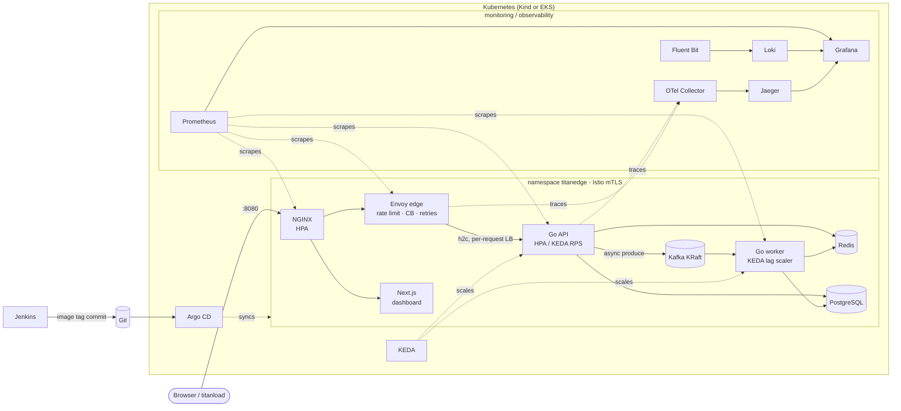

# Handling 50k requests per sec at peak

A production-style, hyperscale DevOps reference platform you can run **for free on a laptop with Kind**, and deploy to **Amazon EKS** when you want real capacity.

```
client ─▶ NGINX ─▶ Envoy ─▶ Go API ─┬─▶ Redis        (cache-aside, live counters)
                                     ├─▶ PostgreSQL   (items, event rollups)
                                     └─▶ Kafka ─▶ Go worker (KEDA-scaled on lag)
                     all east-west traffic: Istio mTLS
```

It ships with **`titanload`**, a Go load generator built for this project: HTTP/1.1, HTTP/2 (h2c/TLS), gRPC, open- and closed-model load, live RPS / p50–p99.9 terminal dashboard, SLO gates for CI, and a coordinator/worker mode that spreads load across many machines or pods and merges their histograms exactly.

> **Reality check.** One laptop cannot serve or generate 1,000,000 requests/second. TitanEdge is built so that the same code, charts and dashboards scale horizontally toward that number; [docs/scaling-to-1m-rps.md](docs/scaling-to-1m-rps.md) does the capacity math (roughly 70–100 API pods, 10–15 load-generator nodes and a tuned edge on EKS).

---

## What's inside

| Area | Implementation | Where |
|---|---|---|
| Frontend | Next.js 16 (App Router, standalone build) live control-plane dashboard | [`web/`](web) |
| API | Go 1.27: `net/http` + h2c, gRPC health, admission control, cache-aside, Kafka producer, OTel tracing, Prometheus RED metrics | [`cmd/api`](cmd/api), [`internal/api`](internal/api) |
| Worker | Kafka consumer (franz-go), at-least-once batching into PostgreSQL + Redis | [`cmd/worker`](cmd/worker), [`internal/worker`](internal/worker) |
| Load generator | `titanload` CLI, dashboard, distributed mode, SLO gates | [`cmd/titanload`](cmd/titanload), [`internal/titanload`](internal/titanload) |
| Data | PostgreSQL 17, Redis 8, Kafka 4 (KRaft) - in-cluster, or RDS / ElastiCache on EKS | [`charts/platform/templates/datastores.yaml`](charts/platform/templates/datastores.yaml) |
| Edge | NGINX (tuned, sampled JSON logs) → Envoy (rate limit, circuit breakers, retries, outlier detection, per-request LB) | [`charts/platform/templates/nginx.yaml`](charts/platform/templates/nginx.yaml), [`envoy.yaml`](charts/platform/templates/envoy.yaml) |
| Containers | Distroless multi-stage Go image, standalone Next.js image, CI toolbox | [`build/`](build), [`web/Dockerfile`](web/Dockerfile) |
| Kubernetes | Deployments, StatefulSets, Services, Ingress, HPA, KEDA, PDB, NetworkPolicy, ConfigMaps, Secrets, RBAC, Pod Security | [`charts/platform`](charts/platform), [`k8s/`](k8s) |
| Service mesh | Istio: STRICT mTLS, AuthorizationPolicies, DestinationRules, Sidecar scoping | [`templates/istio.yaml`](charts/platform/templates/istio.yaml) |
| Autoscaling | CPU HPAs, KEDA Kafka-lag scaler for workers, KEDA Prometheus RPS scaler for the API | [`templates/api.yaml`](charts/platform/templates/api.yaml), [`worker.yaml`](charts/platform/templates/worker.yaml) |
| Observability | Prometheus + Alertmanager + Grafana, Loki + Fluent Bit, OpenTelemetry Collector + Jaeger, 5 dashboards, recording + alert rules | [`addons/`](addons), [`charts/platform/dashboards`](charts/platform/dashboards), [`files/prometheus-rules.yaml`](charts/platform/files/prometheus-rules.yaml) |
| CI | Jenkins on Kubernetes: verify → BuildKit images → Trivy → GitOps promote → titanload SLO gate | [`Jenkinsfile`](Jenkinsfile), [`jenkins/`](jenkins) |
| CD | Argo CD app-of-apps with sync waves | [`gitops/argocd`](gitops/argocd) |
| IaC | Terraform modules: kind-cluster, platform-addons, vpc, eks, ecr, rds, elasticache; envs `kind` and `eks` | [`infra/terraform`](infra/terraform) |
| Config mgmt | Ansible: workstation bootstrap, kernel tuning, distributed titanload fleet via systemd | [`ansible/`](ansible) |
| Docs | Architecture (Mermaid), setup, runbook, scaling, security, ADRs | [`docs/`](docs) |

## Architecture



More diagrams (request/write sequences, autoscaling loop, CI/CD, deployment topology): [docs/architecture.md](docs/architecture.md).

## Quick start

### Option A - Docker Compose (fastest, ~3 GB RAM)

```bash
docker compose -f deploy/compose/docker-compose.yml up -d --build
open http://localhost:8080                      # dashboard
curl http://localhost:8080/api/v1/ping
docker compose -f deploy/compose/docker-compose.yml --profile obs up -d   # + Grafana :3001, Jaeger :16686
```

### Option B - Kind (the real platform, free)

Prerequisites: Docker (6 GB+ RAM for `lite`, 12 GB+ for `full`), kind, kubectl, Helm, Go. See [Windows](docs/setup-windows.md) / [Linux](docs/setup-linux.md) setup.

```bash
make up                  # cluster + registry + images + add-ons + platform + smoke test
make up PROFILE=full     # also Istio mTLS, Argo CD, Jenkins
```

The same steps, one at a time:

```bash
scripts/kind-up.sh                        # kind create cluster --name titan + local registry
scripts/build-images.sh                   # build & push api, worker, web, titanload
scripts/install-addons.sh --profile lite  # metrics-server, kube-prometheus-stack, Loki, Fluent Bit, OTel, Jaeger, KEDA
helm install titan ./charts/platform -n titanedge --create-namespace -f environments/kind/values.yaml
kubectl get pods -A && kubectl get hpa -n titanedge
```

| URL | What |
|---|---|
| http://localhost:8080 | TitanEdge dashboard (NGINX → Next.js) |
| http://localhost:8080/api/v1/ping | API through NGINX → Envoy |
| http://localhost:3000 | Grafana (admin / admin) - folder *TitanEdge* |
| http://localhost:9090 | Prometheus |
| http://localhost:16686 | Jaeger |
| https://localhost:8443 | Argo CD (`full`) |
| http://localhost:8081 | Jenkins (`full`) |

### Generate load

```bash
go run ./cmd/titanload run -u http://localhost:8080/api/v1/ping -c 256 -d 60s          # live dashboard
go run ./cmd/titanload run -u http://localhost:8080/api/v1/ping -r 20000 --ramp 15s -m http2
go run ./cmd/titanload run -u grpc://localhost:9090 -c 256 -d 30s                      # needs a port-forward
make load-cluster                                                                        # distributed, in-cluster
```

Watch pods scale: `kubectl get hpa,scaledobjects -n titanedge -w` and the **TitanEdge / TitanLoad** Grafana dashboard. Full guide: [docs/titanload.md](docs/titanload.md).

### Option C - Terraform

```bash
terraform -chdir=infra/terraform/envs/kind init && terraform -chdir=infra/terraform/envs/kind apply   # free
terraform -chdir=infra/terraform/envs/eks  init && terraform -chdir=infra/terraform/envs/eks  apply   # costs money
```

See [docs/eks-deployment.md](docs/eks-deployment.md).

## API

| Method | Path | Notes |
|---|---|---|
| GET | `/api/v1/ping` | Zero-dependency hot path for raw throughput |
| GET | `/api/v1/items/{id}` | Redis cache-aside over PostgreSQL (`X-Cache: HIT/MISS`) |
| GET | `/api/v1/items?limit=20` | Latest items |
| POST | `/api/v1/items` | `{"name": "...", "payload": {...}}` → PostgreSQL + `item.created` event |
| POST | `/api/v1/events` | `{"type": "page.view", "data": {...}}` → Kafka, returns 202 |
| GET | `/api/v1/stats` | Pod, uptime, in-flight, items, events processed |
| GET | `/healthz`, `/readyz` | Liveness / readiness (dependency checks, cached 1s) |
| gRPC | `grpc.health.v1.Health/Check` on :9090 | titanload gRPC mode |
| GET | `:9102/metrics` | Prometheus (separate port, never exposed at the edge) |

## Repository layout

```
cmd/                 api, worker, titanload entry points
internal/            api, cache, config, events, store (+ migrations), worker, observability, titanload/*
web/                 Next.js dashboard
build/               Dockerfiles (Go services, CI toolbox)
deploy/compose/      docker-compose stack with NGINX, Envoy, Prometheus, Grafana, Loki, Fluent Bit, OTel, Jaeger
charts/platform/     Helm chart for the whole application tier (+ dashboards, rules)
charts/titanload/    Helm chart for distributed in-cluster load tests
environments/        values overlays: kind, kind-full, eks
addons/              pinned versions, values and local charts for cluster add-ons
gitops/argocd/       AppProject, app-of-apps, child Applications
infra/terraform/     modules + envs (kind, eks)
ansible/             playbooks and roles
jenkins/             agent pod, RBAC
kind/ k8s/           cluster config, namespaces
scripts/             kind-up, build-images, install-addons, deploy, load-test, smoke, teardown
tools/dashboards/    Grafana dashboards as code
docs/                architecture, setup, operations
```

## Development

```bash
make test        # Go unit tests (engine, histogram, distributed protocol, handlers, worker)
make lint        # go vet, gofmt, tsc, helm lint
make dashboards  # regenerate Grafana JSON
make help        # everything else
```

## Documentation

- [Architecture](docs/architecture.md) · [Scaling to 1M RPS](docs/scaling-to-1m-rps.md) · [titanload](docs/titanload.md)
- [Windows setup](docs/setup-windows.md) · [Linux setup](docs/setup-linux.md) · [Kind guide](docs/kind-quickstart.md) · [EKS](docs/eks-deployment.md)
- [Observability](docs/observability.md) · [CI/CD](docs/ci-cd.md) · [Security](docs/security.md)
- [Runbook](docs/runbook.md) · [Troubleshooting](docs/troubleshooting.md) · [ADRs](docs/adr)
