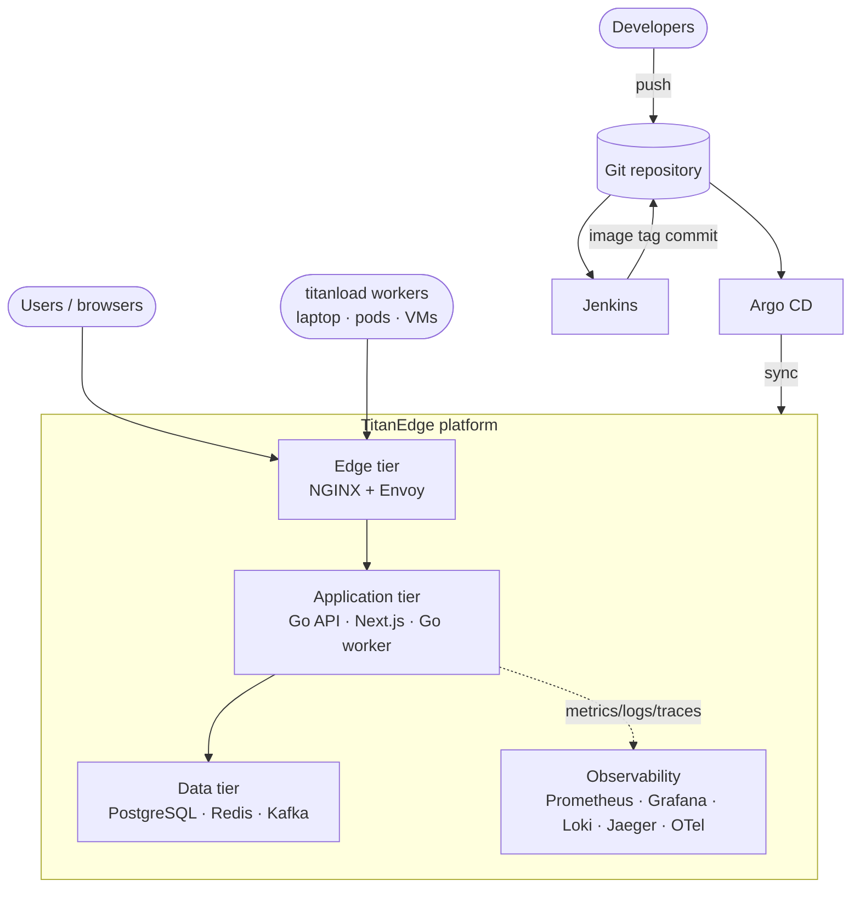
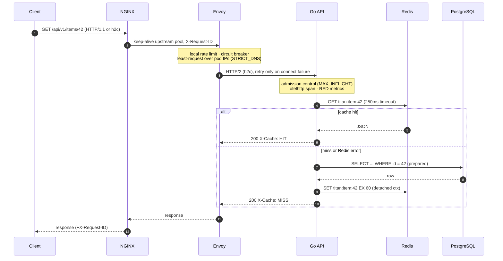
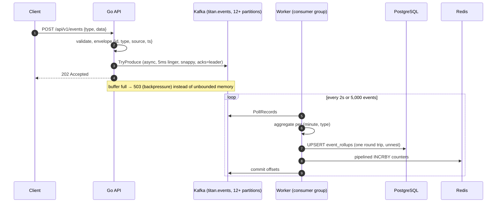
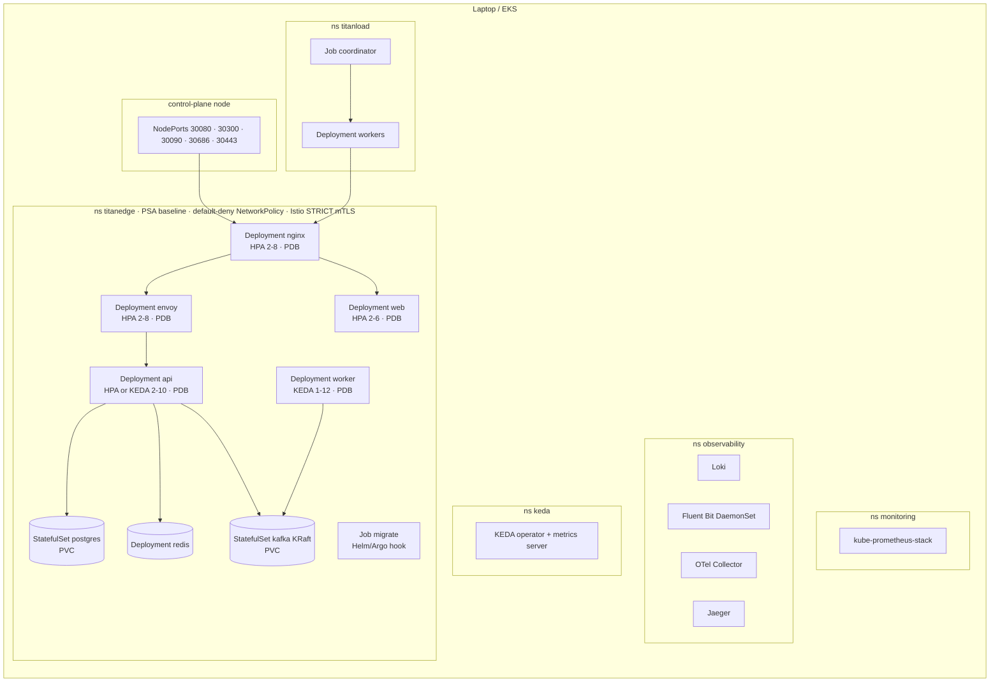
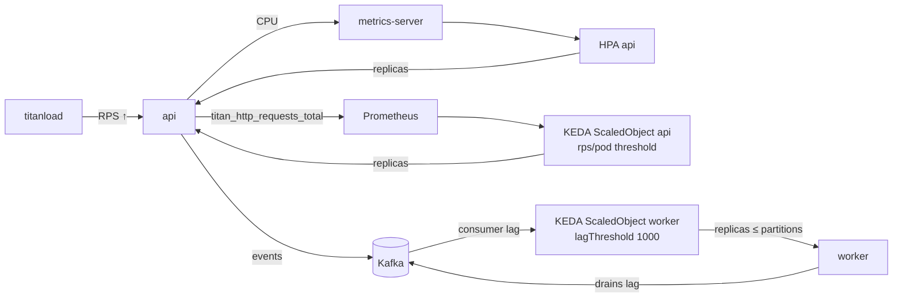
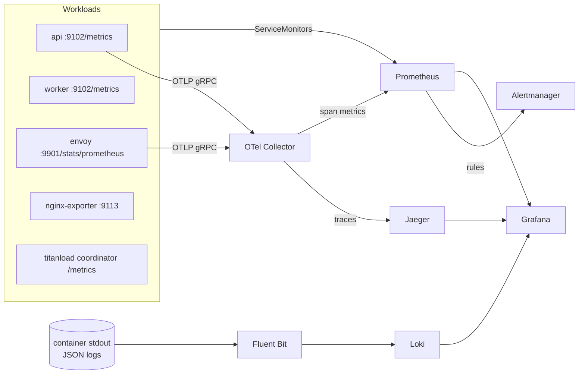
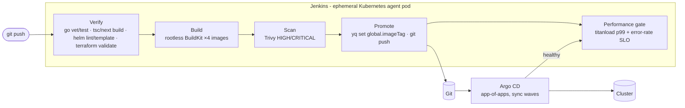

# Architecture

TitanEdge is a read-heavy and write-heavy HTTP service behind a two-tier edge, with an asynchronous event pipeline, full observability and GitOps delivery. Every component is horizontally scalable; state lives only in PostgreSQL, Redis and Kafka.

## 1. System context

## 2. Request path (read, cache-aside)

Design points:

- **Two proxy tiers, different jobs.** NGINX terminates client connections cheaply (hundreds of thousands of idle keep-alives, gzip, static caching of Next.js assets). Envoy does L7 traffic management: per-request load balancing across pod IPs (critical for HTTP/2, where kube-proxy would pin a whole connection to one pod), outlier ejection, retry budgets, circuit breakers and local rate limiting.
- **Admission control in the API.** A non-blocking semaphore returns `503 Retry-After: 1` above `MAX_INFLIGHT`. Under overload the service stays fast for admitted requests instead of timing everyone out, and `titan_http_shed_total` tells the autoscaler story.
- **Degrade, don't fail.** A slow or dead Redis falls through to PostgreSQL. `/api/v1/ping` has no dependencies and keeps working when all backends are down.

## 3. Write path (events)

Delivery is **at-least-once**: offsets are committed only after the batch is persisted, and consumer-group rebalances are blocked until the pending batch is flushed, so a scale-in by KEDA does not double-count.

## 4. Kubernetes topology

## 5. Autoscaling loop

`api.autoscaling.type` selects `hpa` (CPU, default, works with plain metrics-server) or `keda` (requests/second per pod from Prometheus, plus a CPU trigger). Workers always scale on Kafka lag when KEDA is installed and fall back to a CPU HPA when it is not; `maxReplicaCount` is capped at the partition count because extra consumers would sit idle.

## 6. Observability data flow

- Metrics are served on a **separate port (9102)**, so the edge can never expose them and Istio can mark only that port PERMISSIVE for Prometheus while the application port stays STRICT mTLS.
- Logs are JSON (`log/slog`, NGINX `escape=json`, Envoy `json_format`) and **sampled**: all 5xx plus 1% of the rest. Full access logs at 100k RPS would cost more CPU than serving the traffic.
- Traces are head-sampled at 1% (`TRACE_SAMPLE_RATIO`), parent-based so an upstream decision is honoured. Loki's derived field links a `trace_id` in a log line to Jaeger.

## 7. Delivery pipeline

Argo CD sync waves order the cluster build-out: namespaces (-30) → metrics-server (-20) → Prometheus CRDs / KEDA (-15) → Loki (-10) → Fluent Bit, OTel, Jaeger (-5) → platform (0) → migration hook (1).

## 8. Failure modes

| Failure | Behaviour |
|---|---|
| API pod dies | Readiness removes it; Envoy health checks + outlier detection eject it within seconds; PDB keeps ≥1 during voluntary disruption |
| Redis down | Reads fall back to PostgreSQL (`titan_cache_requests_total{result="error"}`), `/readyz` fails so the pod is flagged |
| PostgreSQL down | Item routes return 500/503; ping and events keep working; worker retains its batch and retries without committing offsets |
| Kafka down / slow | Producer buffers up to 250k records then returns 503 (`TitanKafkaBackpressure` alert) |
| Traffic spike | Envoy local rate limit → API admission control → HPA/KEDA scale-out; shed requests are fast 503s, not timeouts |
| Node drain | PDBs + `maxUnavailable: 0` rolling updates + `preStop` sleep + graceful HTTP/gRPC shutdown |
