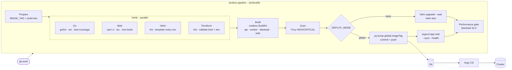

# CI/CD: Jenkins + Argo CD



## Jenkins

Installed by `scripts/install-addons.sh --profile full` with [addons/values/jenkins.yaml](../addons/values/jenkins.yaml):

- Configuration as Code creates the `titanedge` pipeline job pointing at `TITANEDGE_REPO_URL` (edit the value or the env var).
- Builds run in **ephemeral agent pods** ([jenkins/agent-pod.yaml](../jenkins/agent-pod.yaml)): `golang`, `node`, `tools` (helm, kubectl, yq, argocd - [build/ci-tools.Dockerfile](../build/ci-tools.Dockerfile)), `terraform`, `trivy` and rootless `buildkit`. Nothing is installed on the controller; no Docker socket is mounted.
- [jenkins/k8s/rbac.yaml](../jenkins/k8s/rbac.yaml) grants the Jenkins service account deploy rights in `titanedge` (helm mode) and pod rights in `titanload` (performance gate) - nothing cluster-wide.

### Credentials to create

| ID | Type | Used for |
|---|---|---|
| `git-push` | Username + token | committing the new image tag (gitops mode) |
| `argocd-token` | Secret text | `argocd app wait` (create with `argocd account generate-token --account jenkins` after adding a `jenkins` account with the `titanedge:deployer` project role) |

### Parameters

| Parameter | Default | |
|---|---|---|
| `DEPLOY_MODE` | `gitops` | `gitops` (commit, Argo CD deploys), `helm` (direct), `none` (build only) |
| `ENVIRONMENT` | `kind` | which `environments/<env>/values.yaml` to promote into |
| `RUN_LOAD_TEST` | `true` | performance gate after deployment |
| `LOAD_DURATION` / `LOAD_CONCURRENCY` | `60s` / `64` | gate size |
| `SLO_P99` / `SLO_ERROR_RATE` | `250ms` / `1` | gate thresholds; titanload exits 2 → stage fails |

### Registries

On Kind, agent pods push to `kind-registry:5000` (the registry container on the `kind` Docker network) and nodes pull the same images as `localhost:5001/...`. On EKS set `PUSH_REGISTRY` and `PULL_REGISTRY` to the ECR registry from `terraform output ecr_registry` and give the agent pod an ECR push role through EKS Pod Identity.

## Argo CD (GitOps)

```bash
git remote add origin https://github.com/<you>/titanedge.git && git push -u origin main
scripts/argocd-bootstrap.sh https://github.com/<you>/titanedge.git
```

- [gitops/argocd/project.yaml](../gitops/argocd/project.yaml): an `AppProject` restricting source repos and defining `deployer` (get + sync, used by CI) and `readonly` roles.
- [gitops/argocd/root-app.yaml](../gitops/argocd/root-app.yaml): **app of apps** that syncs everything in [gitops/argocd/apps](../gitops/argocd/apps).
- Child applications use **multi-source** Helm: upstream chart + values from this repo (`$values/addons/values/...`), so versions and configuration are both reviewed in Git.
- **Sync waves** order the bootstrap: namespaces → metrics-server → kube-prometheus-stack + KEDA (CRDs) → Loki → Fluent Bit / OTel / Jaeger → platform → migration hook. The custom health check for `Application` resources in [addons/values/argocd.yaml](../addons/values/argocd.yaml) makes the root app wait for each wave to become healthy.
- The platform app ignores `/spec/replicas` on Deployments - HPAs and KEDA own replica counts.
- Optional Istio apps live in [gitops/argocd/optional](../gitops/argocd/optional).

### Promotion model

```
main ──commit "deploy(kind): titanedge 42-1a2b3c4d"──▶ environments/kind/values.yaml
                                                         │
                                          Argo CD detects drift, syncs
                                                         ▼
                             migrate hook (wave 1) → rolling update (maxUnavailable 0)
```

Rollback is `git revert` of the deploy commit (or `argocd app rollback titanedge-platform`), which Argo CD reconciles like any other change.
