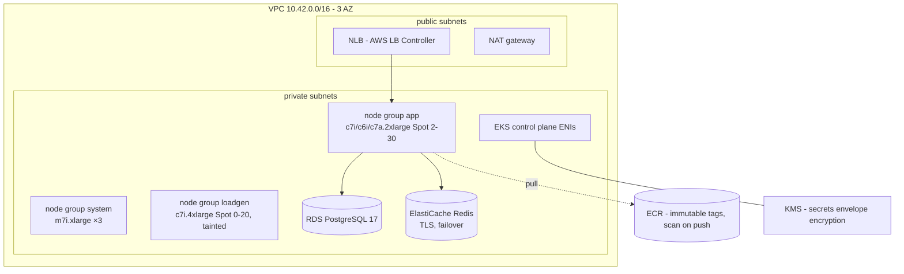

# Optional: Amazon EKS

> **This path costs money.** A minimal idle stack (EKS control plane, 3 system nodes, 2 app nodes, NAT gateway, RDS, ElastiCache) is roughly **$20-30/day**. A 1M RPS test hour is estimated in [scaling-to-1m-rps.md](scaling-to-1m-rps.md). Always `terraform destroy` test stacks.

## What Terraform creates



| Module | Resources |
|---|---|
| [vpc](../infra/terraform/modules/vpc) | VPC, IGW, 3 public + 3 private subnets with ELB discovery tags, NAT (single or per-AZ), S3 gateway endpoint |
| [eks](../infra/terraform/modules/eks) | Cluster (API auth mode, KMS-encrypted secrets, control-plane logs, standard support), access entries, node role, managed node groups (labels, taints, Spot), add-ons: vpc-cni, kube-proxy, coredns, eks-pod-identity-agent, aws-ebs-csi-driver (Pod Identity) |
| [ecr](../infra/terraform/modules/ecr) | Repositories for every image, lifecycle policies |
| [rds](../infra/terraform/modules/rds) | PostgreSQL with RDS-managed master secret, gp3, Performance Insights, parameter group |
| [elasticache](../infra/terraform/modules/elasticache) | Redis replication group, TLS in transit, encryption at rest, failover |
| [platform-addons](../infra/terraform/modules/platform-addons) | Same add-ons as Kind (Prometheus stack, Loki, Fluent Bit, OTel, Jaeger, KEDA, Istio, Argo CD) with EKS overrides |
| env [eks](../infra/terraform/envs/eks) | gp3 default StorageClass, AWS Load Balancer Controller (Pod Identity, IAM policy fetched from upstream) |

## Deploy

```bash
cd infra/terraform/envs/eks
cp terraform.tfvars.example terraform.tfvars      # set region, api_allowed_cidrs, admins
cp backend.tf.example backend.tf                  # optional remote state (S3 + native locking)
terraform init
terraform apply
$(terraform output -raw kubeconfig_command)
```

### Push images to ECR

```bash
REG=$(terraform output -raw ecr_registry)
aws ecr get-login-password | docker login --username AWS --password-stdin "$REG"
for c in api worker titanload; do
  docker build -f build/go.Dockerfile --build-arg CMD=$c --build-arg VERSION=1.0.0 -t $REG/titanedge/$c:1.0.0 . && docker push $REG/titanedge/$c:1.0.0
done
docker build -t $REG/titanedge/web:1.0.0 web && docker push $REG/titanedge/web:1.0.0
```

### Database secret

RDS keeps the master password in Secrets Manager. Build the Kubernetes secret the chart expects (`existingSecret: titan-db` with keys `password` and `database-url`):

```bash
ARN=$(terraform output -raw rds_master_secret_arn)
PW=$(aws secretsmanager get-secret-value --secret-id "$ARN" --query SecretString --output text | jq -r .password)
EP=$(terraform output -raw rds_endpoint)
kubectl create namespace titanedge --dry-run=client -o yaml | kubectl apply -f -
kubectl -n titanedge create secret generic titan-db \
  --from-literal=password="$PW" \
  --from-literal=database-url="postgres://titan:$(jq -rn --arg p "$PW" '$p|@uri')@${EP}/titan?sslmode=require"
```

For production, sync it with External Secrets Operator instead so rotation is automatic.

### Install the platform

Edit [environments/eks/values.yaml](../environments/eks/values.yaml): `global.imageRegistry`, `global.imageTag`, `externalRedis.addr` (`terraform output redis_endpoint`). Then:

```bash
kubectl label namespace titanedge istio-injection=enabled --overwrite
helm upgrade --install titan charts/platform -n titanedge -f environments/eks/values.yaml --wait --timeout 20m
kubectl -n titanedge get svc titan-nginx     # EXTERNAL-IP is the NLB hostname
```

Or point Argo CD's `titanedge-platform` application at `environments/eks/values.yaml`.

### Load test from inside the VPC

```bash
helm upgrade --install load charts/titanload -n titanload --create-namespace \
  --set image.registry=$REG --set image.tag=1.0.0 --set workers=10 \
  --set load.url=http://titan-nginx.titanedge.svc.cluster.local/api/v1/ping \
  --set load.rate=300000 --set load.duration=10m
```

To land workers on the dedicated `loadgen` nodes add a toleration for `dedicated=loadgen:NoSchedule` and a `titan/pool: loadgen` node selector to the worker Deployment.

## Tear down

```bash
helm -n titanedge uninstall titan      # releases the NLB first
terraform destroy
```

## Hardening checklist before production

- Restrict `api_allowed_cidrs`; consider a private-only endpoint with a VPN.
- `single_nat_gateway = false`, `environment = "prod"` (Multi-AZ RDS, deletion protection).
- External Secrets Operator for DB/Redis credentials; Sealed Secrets or SOPS for anything in Git.
- Cluster Autoscaler or Karpenter for node scaling.
- Remote Terraform state with locking (`backend.tf.example`).
- WAF / Shield Advanced in front of the NLB (or an ALB) for internet-facing traffic.
