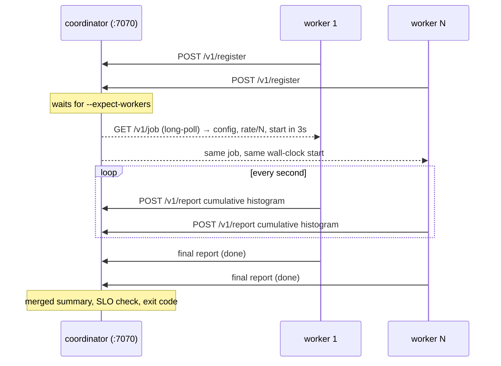

# titanload

`titanload` is TitanEdge's load generator: a single static Go binary with a live terminal dashboard, HTTP/1.1, HTTP/2 and gRPC support, SLO gates and a coordinator/worker mode for distributed load.

```
 TITANLOAD  ▸ GET http://localhost:8080/api/v1/ping  [http2]
 concurrency 256  target 50,000 rps  elapsed 00:00:42
 ──────────────────────────────────────────────────────────────
 RPS              49,871   avg 48,112   peak 50,340
 Requests      2,020,704   ok 2,020,650   failed 54 (0.003%)
 Throughput      11.4 MB/s
 ──────────────────────────────────────────────────────────────
 Latency (last 0.5s)
   p50 1.21ms     p90 2.88ms     p95 3.64ms     p99 7.90ms     p99.9 18.20ms
 Latency (overall)
   min 212µs      mean 1.49ms   p99 8.41ms     max 96.10ms
 ──────────────────────────────────────────────────────────────
 RPS   ▁▂▃▄▅▆▇███████████████████████▇██████████
 p99   ▁▁▂▂▁▁▁▂▁▁▂▃▁▁▁▁▂▁▁▁▁▁▂▁▁▁▁▁▁▁▂▁▁▁▁▁▁▁▁▁▁▁
 ──────────────────────────────────────────────────────────────
 Distribution
   <1ms       ■■■■■■■■■■■■■■■■■■■■■■  38.20%
   1-5ms      ■■■■■■■■■■■■■■■■■■■■■■■■■■■■■■■■  57.40%
   5-10ms     ■■  3.60%
   ...
 Status  2xx 2,020,650  3xx 0  4xx 0  5xx 54  transport 0
 [██████████████████████████░░░░░░░░░░░░░░░░░]  70%
```

## Build

```bash
make titanload            # ./bin/titanload
go install ./cmd/titanload
docker build -f build/go.Dockerfile --build-arg CMD=titanload -t titanload .
```

## Commands

```
titanload run [flags] [URL]           run a load test from this machine
titanload coordinator [flags] [URL]   orchestrate remote workers and aggregate results
titanload worker --coordinator URL    execute load on behalf of a coordinator
titanload version
```

Exit codes: `0` success, `1` error, `2` SLO violated.

## Flags (run and coordinator)

| Flag | Default | Meaning |
|---|---|---|
| `-u, --url` | | Target: `http://`, `https://`, `grpc://`, `grpcs://` |
| `--targets FILE` | | Lines of `METHOD URL [BODY \| @file]`, used round-robin |
| `-m, --mode` | from URL | `http1`, `http2` (h2c for `http://`, ALPN h2 for `https://`), `grpc` |
| `-c, --concurrency` | 64 | Request goroutines (per worker in distributed mode) |
| `--connections` | 0 | Max connections per host (HTTP) / channel count (gRPC) |
| `-r, --rate` | 0 | Target requests/second (open model). `0` = as fast as possible (closed model) |
| `-d, --duration` | 30s | Test length (`0` = until `-n`) |
| `-n, --requests` | 0 | Stop after N requests (exact) |
| `--ramp` | 0 | Ramp the rate (open model) or goroutine start (closed model) linearly |
| `-t, --timeout` | 5s | Per-request timeout |
| `-X, --method` | GET | HTTP method |
| `-H` | | Header `"Key: Value"`, repeatable |
| `-b, --body` / `--body-file` | | Request body (JSON content type by default) |
| `-k, --insecure` | false | Skip TLS verification |
| `--no-keepalive` | false | New connection per request (tests accept/TLS cost) |
| `--no-dashboard` | auto | Plain progress lines (automatic when stdout is not a TTY) |
| `--json FILE` | | Machine-readable summary (`-` for stdout) |
| `--metrics-addr` | | Serve live Prometheus metrics, e.g. `:9464` |
| `--slo-p95`, `--slo-p99` | | Fail with exit 2 when exceeded |
| `--slo-error-rate` | | Percent, e.g. `1` = 1% |
| `--slo-min-rps` | | Fail when the achieved rate is lower |

Coordinator only: `--listen :7070`, `--expect-workers N`, `--token` (or `TITANLOAD_TOKEN`), `--start-delay 3s`.
Worker only: `--coordinator URL` (or `TITANLOAD_COORDINATOR`), `--name`, `--token`, `--loop`.

## Examples

```bash
# Closed model: 256 goroutines as fast as the server allows
titanload run -u http://localhost:8080/api/v1/ping -c 256 -d 60s

# Open model at 20k rps with a 15s ramp over HTTP/2 cleartext
titanload run -u http://localhost:8080/api/v1/ping -r 20000 --ramp 15s -m http2 -c 512

# Mixed read/write traffic
cat > targets.txt <<'EOF'
GET  http://localhost:8080/api/v1/items/1
GET  http://localhost:8080/api/v1/items/2
POST http://localhost:8080/api/v1/events {"type":"page.view","data":{"path":"/"}}
EOF
titanload run --targets targets.txt -c 128 -d 2m

# gRPC health checks straight at the API (kubectl -n titanedge port-forward svc/titan-api 9090)
titanload run -u grpc://localhost:9090 -c 256 -d 30s

# CI gate
titanload run -u http://titan-nginx.titanedge/api/v1/ping -c 64 -d 60s --no-dashboard \
  --slo-p99 250ms --slo-error-rate 1 --json report.json
```

## Distributed mode



```bash
# host A
titanload coordinator --expect-workers 3 --token s3cret \
  -u http://target/api/v1/ping -r 150000 -d 5m --ramp 30s --slo-p99 100ms

# hosts B, C, D
titanload worker --coordinator http://hostA:7070 --token s3cret
```

- Rate and request budget are split evenly; concurrency is per worker.
- Snapshots are **cumulative, mergeable histograms**, so the aggregated p99 is exact across workers, not an average of percentiles.
- A worker that stops reporting for 15s is marked `lost`; the run still completes.
- Kubernetes: [charts/titanload](../charts/titanload) (coordinator Job + worker Deployment, spread one per node).
- VMs: [ansible/playbooks/loadgen.yml](../ansible/playbooks/loadgen.yml) installs workers as systemd services with tuned kernels.

## How it measures

- **Histogram**: log-linear buckets with 2% relative width from 1µs to 60s (906 buckets). Each goroutine writes its own shard with uncontended atomics (≈ 10ns per record); the reporter merges shards twice a second. Percentiles are within ±2% and never exceed the observed max.
- **Coordinated omission**: in open-model mode every request carries its *scheduled* send time and latency is measured from that instant. If the server stalls and requests queue inside titanload, that queueing shows up in p99 - exactly what users would experience. Closed-model results (`-r 0`) measure service time and will look better than reality under saturation.
- **Errors**: any transport error or HTTP status ≥ 400 counts as a failure. Transport errors are classified (`timeout`, `conn_refused`, `conn_reset`, `eof`, `dns`, `tls`, `no_ephemeral_ports`, `too_many_open_files`, `grpc_*`).
- In-flight requests at the end of a run complete normally instead of being reported as cancellations.

## Tuning the load generator

A load generator that saturates first measures itself. Watch titanload's own CPU:

- ~1 CPU core per 20-40k HTTP/1.1 rps with keep-alive; HTTP/2 multiplexing is cheaper per request.
- Raise `ulimit -n` (the Ansible role sets 1,048,576) and widen `net.ipv4.ip_local_port_range`.
- Prefer many workers over one huge process; put them on separate nodes (`loadgen` node group on EKS).
- Keep titanload out of the service mesh (the chart sets `sidecar.istio.io/inject: "false"`).
